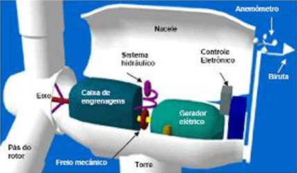

## Introdução 

Desde seus tempos mais remotos o homem busca soluções de facilitar sua vida e seu esforço. seja por meio do uso de sistemas mecânicos ou até mesmo recorrendo às forças de animais. Descoberta em meados do século XVIII, por Benjamin Franklin[^referencia6], a eletricidade é sem sombra de dúvidas um grande avanço para a incansável procura pela comodidade humana. Desde então a ciência está sempre investigando formas de automatizar trabalhos complexos e demorados com o uso de circuitos.

A geração de energia é um assunto muito pesquisado para os dias atuais. Um motivo dessas pesquisas é o constante aumento de energia demandada, seja para atividades domésticas ou serviços industriais. Para tais problemas a eletrônica de potência tem grande colaboração na redução de energia demandada, visando sempre o processamento eletrônico de energia, causando maiores eficiências em circuitos, redução de volume e peso de componentes, para que de tal forma a energia requerida pela população seja menor.

Mesmo com a capacidade de geração de energia presente, em muitos lugares a entrega de energia acaba sendo comprometida, seja pelas distâncias entre subestações, ou até mesmo por eventuais faltas de sistemas  apropriados para uma eficiente distribuição. Em alguns casos até mudanças climáticas acarretam em acidentes e imprevistos com o fornecimento de energia, causando contratempos tanto para os consumidores quanto para as próprias concessionárias.

Ao se fazer o projeto de uma usina, são feitos todos os levantamentos referentes aos seus custos de instauração, licenciamento e retorno.[^referencia7] Esses levantamentos ocasionalmente concluem que pode não ser possível para a empresa a construção desse projeto, o que leva a um fornecimento de energia debilitado até alguns clientes. Outro ponto refletido ao se construir uma usina são os danos que provocados ao redor de sua construção, danos os quais podem ser na parte ambiental, como o desmatamento, a perfuração do solo, a inundação de lugares; ou até mesmo sociais, como a isolação de terrenos para segurança da região ao redor ou o ruído incômodo que será provocado. Esses pontos são também problemas levados em consideração quando uma empresa quer construir uma usina de grande porte.

Para tais problemas se faz importante o estudo completo de fontes de geração e conversão de energia, seus custos, impactos e benefícios em relação as outras formas. Do mesmo modo é necessário compreender as naturezas de produção de energia e a matriz energética nacional e mundial. 

## Matriz energética atual

A geração de energia no Brasil é em sua maior parte hidráulica, o que não é ruim, pois a água é uma fonte renovável de energia, entretanto há danos que são causados com a criação de usinas, como a inundação de uma grande região, causando danos às pessoas que ficam desabrigadas, sem contar à fauna e à flora. Entretanto, no mundo, a situação é outra: a maior parte da energia mundial  em cenário global é feita a base de carvão mineral, uma matéria prima que não é renovável e difícil de ser retirada do meio ambiente.

### Brasil {#sec:matriz_br}

Por mais que atualmente a maior parte da geração da energia elétrica brasileira seja com base na água, é possível destacar um grande aumento e incentivos(seja pelo governo ou pelos movimentos ambientais) de gerações alternativas, como gás natural, biomassa e  eólica. Este fato pode ser observado na comparação dentre as figuras [-@fig:brasil_73] e [-@fig:brasil_18] a seguir. Em 1999, a maior parte da eletricidade provinha de hidrelétricas ao Brasil. Já em 2018, pôde-se notar uma grande mudança no cenário energético nacional.

{#fig:brasil_73 width=300px}

{#fig:brasil_18 width=300px}

Também é perceptível o aumento da participação da geração de carvão mineral, de 1.7% a 2.2%. Por mais que pareça ter aumentado em 0.5 pontos percentuais, na verdade  a geração mineral  brasileira serve para cobrir faltas da geração hidráulica as quais não conseguem ser entregues quando há períodos de secas, causadora do baixo nível nos reservatórios das represas.[^referencia5]

Outro fato importante a ser destacado é a diminuição percentual no uso de hidrelétricas e Ascenção de outras fontes renováveis, tais como eólica e bioenergia sólida. Com esse crescimento pode-se esperar também a redução no uso da própria geração a base de carvão mineral.

### Mundo

O cenário mundial apresenta as mesmas tendências, reduzindo o uso de fontes não renováveis e das hidrelétricas, investindo também em fontes renováveis capazes de entrega energia com menor custo em longo prazo. A [@fig:mundo_18] e a [@fig:mundo_73] podem mostrar tal comparação.

{#fig:mundo_73 width=300px}

{#fig:mundo_18 width=300px}

A participação do petróleo para geração elétrica também diminuiu ao redor do globo nos últimos 46 anos, revelando o interesse em fontes inesgotáveis de energia.

## Geração Distribuida

Nos últimos anos o mundo vem sofrendo mudanças climáticas e outros desastres
socioambientais decorrentes do desenfreado consumismo humano do ultimo século. 
Estes desastres mostraram a todos que caso o planeta não seja bem cuidado os 
dias do Homem podem estar contados. Tal fato tem aumentado o receio de 
autoridades políticas. Com o crescimento desta inquietação com o meio ambiente, 
muitas políticas estratégicas vêm sendo elaboradas com o intuito da preservação 
do meio ambiente.  Essas políticas fazem parte da estratégia do desenvolvimento 
sustentável. 

No Brasil estas políticas surgiram algum tempo depois, entretanto são vistas 
como grandes propulsores para pessoas físicas e jurídicas, as quais enxergam 
nestas políticas oportunidades de grandes negócios ou até mesmo fontes para 
pequenos retornos e auxílios. Nos últimos vinte anos o país tem elaborado 
planos de geração energética sustentável, com planos de alavancar a nação para 
mais perto de outros países de interesse[^referencia9]. Redução em impostos e 
incentivos para produção de energia "limpa" como à base de resíduos ou do vento 
são grandes exemplos destas políticas nacionais.[^referencia8]

Com tais incentivos, muitas pessoas acabam optado por instalar geradores em 
suas residências. A geração própria implica na redução da demanda energética do 
fornecedor. Isso faz com que a própria fatura de luz tenha redução. O 
investimento em uma fonte de energia local tem também retorno a longo prazo, 
devido a fatos como aumento da tarifa repassada pela ANEEL.

Outrossim, há ocasiões pontuais em que o fornecimento de energia é 
impossibilitado, seja por rompimento de cabos entre o consumidor e 
distribuidor, interrupções programadas, acidentes no meio do trajeto do fluxo 
da energia, ou até mesmo por maus projetos residenciais.[^referencia10] Como 
resolução de tais problemas a geração própria acaba sendo muito favorável, 
possibilitando ao morador ou empresário o total funcionamento de seu local de 
laboro. 

Há momentos em que a tarifa de energia sofre alterações, as quais podem ser ou 
não previstas. O que usualmente ocorre é o aumento de tarifa para consumidores 
residenciais devido ao aumento de trabalho necessário para fornecimento de 
eletricidade para as casas, o qual provém de níveis baixos nos reservatórios 
das usinas. Como já comentado na [@sec:matriz_br], como a maior parte da 
energia depende do setor hidráulico, em períodos de seca são necessárias mais 
usinas trabalhando.[^referencia11] Esses valores de tarifas possuem o nome de 
"bandeiras tarifárias". Um outro "aumento" de tarifa pode ser notado em 
indústrias, no que comumente é chamado de "horário de ponta", definido como um 
período de três horas consecutivas, as quais há um grande acréscimo de energia 
demandada para a empresa concessionária, a qual, preservada por leis, cobra a 
energia consumida nessa faixa a uma tarifa específica, logicamente com seu 
valor mais elevado.[^referencia12] 

Com a produção de energia particular, entretanto, o consumo no período de ponta 
pode ser totalmente com base na mesma energia produzida, fazendo com que o 
consumo tarifado seja nulo. De mesmo modo, nos períodos de bandeiras tarifárias 
vermelhas e amarela, o consumo a ser pago encaminha-se ao consumo mínimo, o 
qual é obrigatório ser pago.[^referencia13]

Não obstante, a geração particular de energia acarreta em uma menor demanda 
para a companhia elétrica responsável pela região, o que também diminui a 
demanda energética das usinas geradoras de maiores portes. O que essa 
diminuição da demanda implica é a dispensabilidade de projetos para construção 
de novas usinas. Esses projetos que, como já discutido, trazem consigo vários 
percalços.

A partir de 17 de abril de 2012, qualquer consumidor brasileiro pode produzir 
sua própria energia, desde que oriunda de fontes renováveis ou por "cogeração 
qualificada".[^referencia14] Já em lugares de maior porte, como indústrias e 
hospitais, pode-se fazer uso também de geradores a combustão de derivados do 
petróleo, seja apenas em horário de ponta ou quando há comprometimento na 
entrega de energia. Faz-se importante então um estudo a respeito dessas fontes 
de energia.

### Geração a combustão

Os geradores a diesel ou gasolina estão presentes na maioria das indústrias e 
hospitais, tanto para atender às necessidades em momentos que ocorre falta de 
energia, ou até para uso no período de ponta, com o intuito de reduzir as 
contas.

O funcionamento do gerador a combustão baseia-se na lei de Faraday ([@eq:leifaraday]), onde a variação de campo magnético conduz na produção de um campo 
elétrico, também variável. O combustível causa explosões nos pistões do 
gerador, os quais são responsáveis para dar movimento ao rotor.

$$ \oint \vec{E} \cdot d\vec{s} = -\frac{d\phi_B}{dt} $${#eq:leifaraday}

Essas máquinas contemplam o gerador propriamente dito acoplado com um motor, o 
qual é impulsionado a partir de fluidos, como diesel, óleos pesados, GLP, ou 
outros derivados do petróleo. Toda a rotação é gerada a partir da explosão 
desses fluidos nos pistões do motor (figuras [-@fig:diesel1] e [-@fig:diesel2]).

{#fig:diesel1 height=300px}

{#fig:diesel2 height=300px}

Em geradores de campo giratório, como o da [@fig:rotorgiratório], a tensão é extraída diretamente dos enrolamentos da armadura (estator).[^referencia15] Com a movimentação do motor, um campo elétrico é induzido na armadura, donde flui corrente elétrica.

{#fig:rotorgiratório width=200px}

O formato da onda de saída depende do formato que o campo possui em relação ao 
tempo, os geradores são construídos com a finalidade de produzir ondas em 
formato senoidal.

Como a geração a combustão produz gás carbônico como resultado, a lei permite o 
uso dessas máquinas em pequenas faixas ao longo do dia, objetivando uma menor 
poluição por parte das empresas.

### Geração eólica

Assim como geradores a combustão, a geração eólica toma como base o princípio da conversão de energia mecânica em elétrica por meio da lei de Faraday, a qual testifica a presença de uma força eletromotriz induzida resultante de uma variação de campo magnético sentido pelo circuito.[^referencia16]

A rotação da turbina dos aerogeradores se dá a partir do movimento do vento, que é captado pelas pás. Devido ao tamanho que as pás captadoras possuem, sua rotação não atinge os valores necessários para conversões diretas, então é crucial o uso de caixas de engrenagens, designadas a multiplicar a velocidade de rotação a ser acoplada ao seu respectivo gerador ([@fig:componentes_turbina]).

{#fig:componentes_turbina width=300px}

O anemômetro é capaz de aferir a intensidade, velocidade e direção do vento, dando possibilidade de controlar a angulação das pás, para melhor aproveitamento tanto de rotação quanto da geração.

Mesmo sendo uma fonte de energia renovável e não poluente, a geração eólica ainda traz consigo algumas adversidades. O ar, ao se chocar com as pás, provoca ruídos desconfortáveis para a população próxima. Outro problema a ser citado é o impacto que animais voadores podem causar nas pás, trazendo danos para a produção e diminuindo a vida útil dos equipamentos.

Outro ponto observado é a intermitência que os ventos possuem, sendo provável que em certos momentos de maior demanda não haja vento soprando suficiente, ou até mesmo em situações de demanda em que não há vento algum, trazendo para a geração eólica uma inconstância indesejada.

### Geração fotovoltaica

Dentre os atuais meios de se produzir energia elétrica, um que está sempre em voga é a geração fotovoltaica. Essa geração é silenciosa e abundante. Outro fator que contribui para a geração de energia através do sol é que a estrela tem uma vida muito longa, e inesgotável, comparada ao tempo humano na terra. A energia irradiada na Terra chega a $9,5.10^4$ terawatts, até 10 mil vezes toda a energia consumida no planeta[^referencia3].

As células, em trabalho, não produzem gases ou efluentes, fazendo assim com que o meio ambiente não seja afetado na produção de energia. Este fator é também outro motivo que aponta a vantagem da energia solar em relação às outras formas de geração, e um assunto que é discutido hodiernamente devido à conscientização ambiental a qual muito se fala atualmente.

#### Efeito fotovoltaico 

Atualmente, muito se comenta a respeito da energia solar e sua geração com os painéis e módulos fotovoltaicos. Há muitas pesquisas nesse meio, com objetivos como tornar a tecnologia mais próxima do público. A unidade mais simples para a formação dos módulos são as células. 

A célula fotovoltaica tem seu funcionamento oriundo do efeito fotovoltaico. Este fenômeno é mais antigo do que a maioria das pessoas pensam. Em 1839, Edmond Becquerel percebeu a geração de energia a partir de luz solar incidindo em placas de latão submersas em um líquido eletrólito [^referencia1]. Mais tarde, então, Charles Frittts foi capaz de inventar a primeira bateria de luz solar, feita com base em selênio[^referencia2].

Atualmente as células são fabricadas com semicondutores, materiais que apresentam características intermediárias entre condutores e isolantes. O elemento mais famoso dentre os semicondutores é o silício. O cristal de silício puro é mal condutor elétrico, devido ao fato de conter 4 elétrons livres em sua camada de valência. Para que a condução seja possível, acrescentam-se porcentagens de outros elementos, com a finalidade de deixar o átomo quase estável. A este processo dá-se o nome de "dopagem".

A partir da dopagem do silício com o arsênio ou o fósforo, elementos que apresentam 5 elétrons na última camada, formam-se ligações covalentes entre quatro elétrons, o quinto é propositalmente livre, possibilitando a passagem de corrente elétrica. Por ser dopado com elétrons a mais, é nomeado silício tipo N.

A dopagem do silício tipo P é geralmente feita à base de gálio ou boro, elementos com três elétrons na camada mais distante. Agora são feitas três ligações covalentes, a quarta ligação é propositalmente ausente, e também chamada de lacuna([@fig:dopagem]).

{#fig:dopagem width=300px}

A célula fotovoltaica contem as duas dopagens, sendo uma camada fina de material tipo N e uma camada espessa de material do tipo P, conforme ilustra a [@fig:transversal]. Com isso, é gerado um campo elétrico, também chamado de região PN[^referencia4]. Quando a luz incide na célula, os elétrons recebem energia proveniente dos fótons. Os elétrons, então excitados, são acelerados e fluem através da junção. A corrente gerada origina a diferença de potencial entre as faces P e N.[^referencia4]

{#fig:transversal width=300px}

#### Células fotovoltaicas

O material constituinte da maior parte dos painéis solares é o silício. O elemento semicondutor é comercializado em três formas principais: silício cristalino (c-Si), este sendo mono ou policristalino, ou até mesmo de silicio amorfo (?-Si). 

# Referências

[^referencia1]: Smestad, G. P. Optoelectronics of solar cells, 1a. ed., SPIE: Bellingham, 2002.
[^referencia2]: Komp, R. J. Practical photovoltaics: eletricity from solar cells, 3a. ed., aatec publications: Ann Arbor, 2001.
[^referencia3]: Grätzel, M. Photoelectrochemical cells.  Nature 2001, 414, 338. [CrossRef]
[^referencia4]: https://www.solenerg.com.br/files/monografia_cassio.pdf
[^referencia5]: http://www.mme.gov.br/documents/1138787/1732840/Resenha+Energética+Brasileira+-+edição+2019+v2.pdf/66a837a8-4164-4b37-be4a-59a5ad270c50?version=1.0
[^referencia6]: http://www.ifsc.usp.br/~cibelle/arquivos/T0150-1.pdf
[^referencia7]: https://www.hidroenergia.com.br/veja-quais-sao-as-etapas-para-construcao-de-uma-hidreletrica/
[^referencia8]: https://www.camara.leg.br/noticias/561691-comissao-aprova-incentivo-a-geracao-de-energia-a-partir-de-residuos/
[^referencia9]: http://epe.gov.br/pt/publicacoes-dados-abertos/publicacoes/Plano-Nacional-de-Energia-PNE-2030
[^referencia10]: https://www.cpfl.com.br/energias-sustentaveis/eficiencia-energetica/uso-consciente/falta-de-energia/Paginas/default.aspx
[^referencia11]: http://www.aneel.gov.br/bandeiras-tarifarias
[^referencia12]: http://www.mme.gov.br/documents/10584/1985241/Manual%20de%20Tarif%20En%20El%20-%20Procel_EPP%20-%20Agosto-2011.pdf
[^referencia13]: http://www2.aneel.gov.br/arquivos/PDF/Cartilha_1p_atual.pdf
[^referencia14]: http://www2.aneel.gov.br/cedoc/ren2012482.pdf
[^referencia15]: https://static.weg.net/medias/downloadcenter/h68/h68/WEG-curso-dt5-caracter-sticas-e-especifica-o-de-geradores-artigo-tecnico-portugues.pdf
[^referencia16]: http://www.ifsc.usp.br/~strontium/Teaching/Material2010-2%20FFI0106%20LabFisicaIII/11-LeideInducaodeFaraday.pdf
